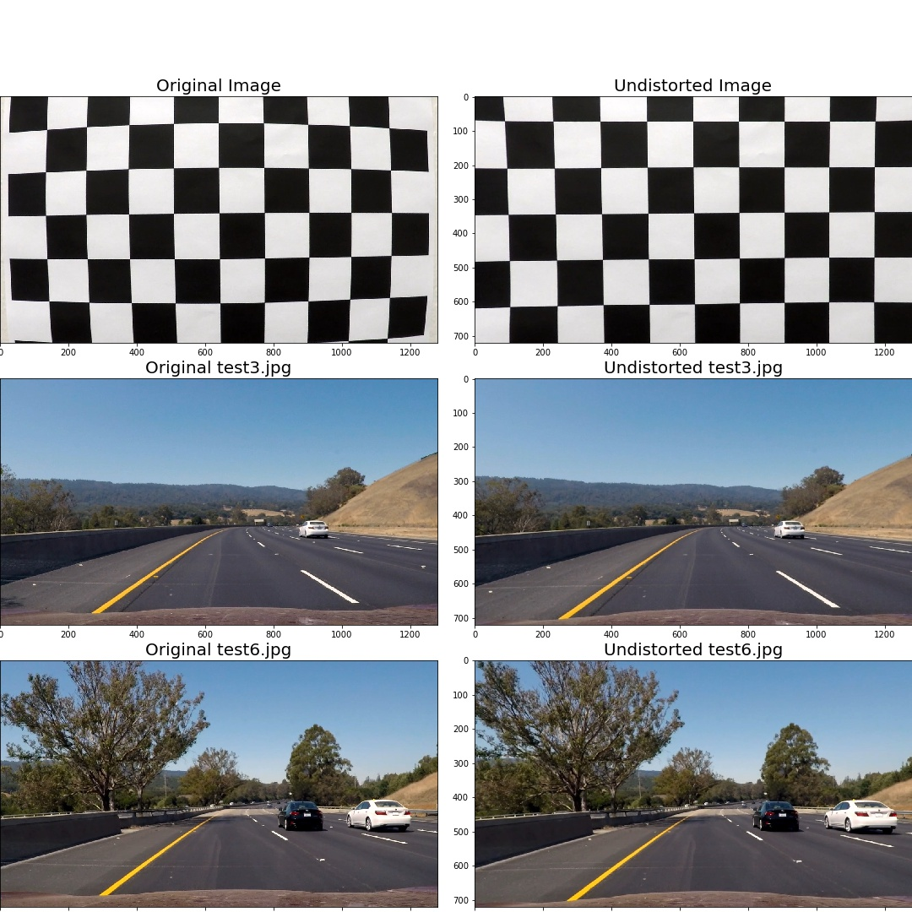
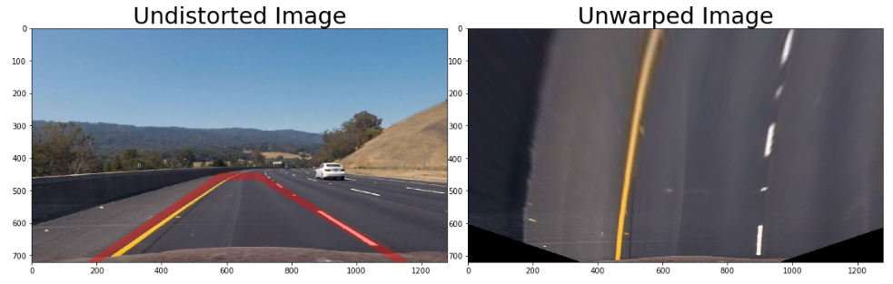
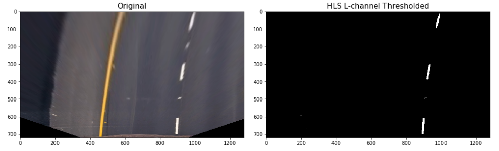
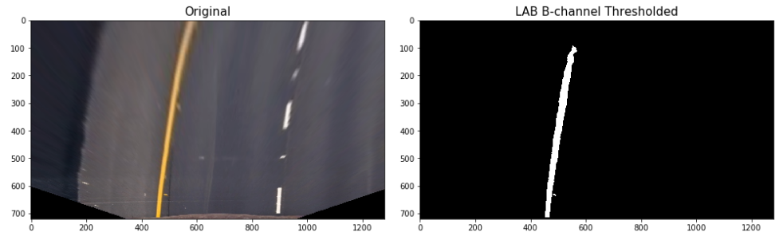
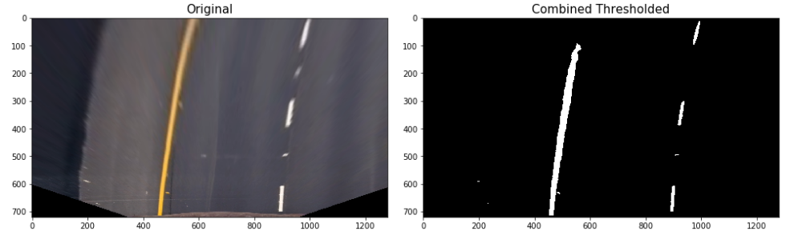
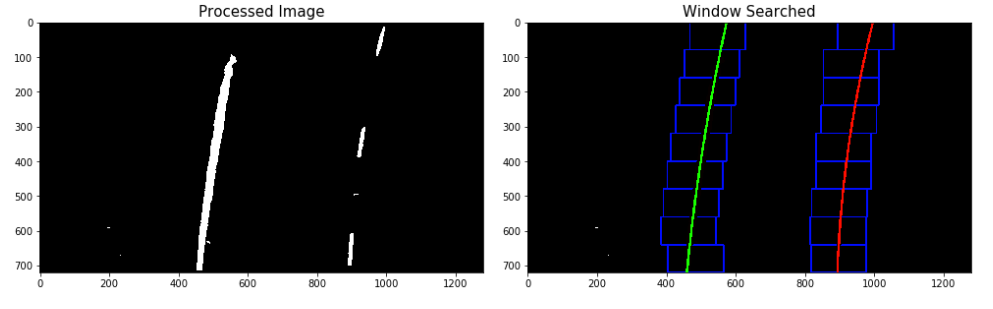
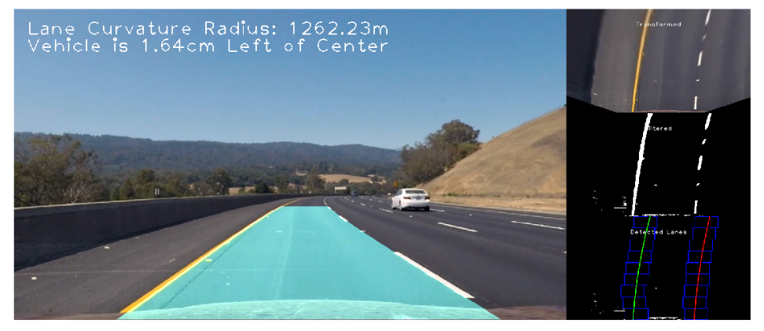

# Advanced Lane Finding

[](http://www.udacity.com/drive)

The goals / steps of this project are the following:

* Compute the camera calibration matrix and distortion coefficients given a set of chessboard images.
* Apply a distortion correction to raw images.
* Use color transforms, gradients, etc., to create a thresholded binary image.
* Apply a perspective transform to rectify binary image ("birds-eye view").
* Detect lane pixels and fit to find the lane boundary.
* Determine the curvature of the lane and vehicle position with respect to center.
* Warp the detected lane boundaries back onto the original image.
* Output visual display of the lane boundaries and numerical estimation of lane curvature and vehicle position.


## Camera Calibration
Using OpenCV's 'cv2.findChessboardCorners()' function to obtain two lists of points 'objpoint' (points in 3d space) and 'imgpoints' (points in 2d space).

```python
chess_corners_x = 9
chess_corners_y = 6

# prepare object points, like (0,0,0), (1,0,0), (2,0,0) ....,(6,5,0)
objp = np.zeros((chess_corners_x * chess_corners_y, 3), np.float32)
objp[:,:2] = np.mgrid[0:chess_corners_x,0:chess_corners_y].T.reshape(-1,2)

# Arrays to store object points and image points from all the images.
objpoints = [] # 3d points in real world space
imgpoints = [] # 2d points in image plane.

chess_calib_imgs = []

# Step through the list and search for chessboard corners
for img in chess_imgs:
    gray = cv2.cvtColor(img[0], cv2.COLOR_BGR2GRAY)

    # Find the chessboard corners
    ret, corners = cv2.findChessboardCorners(gray, (chess_corners_x, chess_corners_y),None)

    # If found, add object points, image points
    if ret == True:
        objpoints.append(objp)
        imgpoints.append(corners)

        # Draw and display the corners
        proc_img = cv2.drawChessboardCorners(img[0], (chess_corners_x, chess_corners_y), corners, ret)
        chess_calib_imgs.append((proc_img, img[1]))

print("Done findChessboardCorners.")
```
Before and after examples



## Image Processing Pipeline

### Perspective Transform
Transforming our perspective of the road to a bird's eye view.
```python
# Lane masking and coordinates for perspective transform
h, w = test_img1_undistorted.shape[:2]

src = np.float32([[190, 720],
                  [582, 457],
                  [701, 457],
                  [1145, 720]])
offset = [250,0]
dst = np.float32([src[0] + offset,
                  np.array([src[0, 0], 0]) + offset,
                  np.array([src[3, 0], 0]) - offset,
                  src[3] - offset])

test_img1_unwarped, M, Minv = pers_transform(test_img1_undistorted, src, dst)

# Visualize warp
f, (ax1, ax2) = plt.subplots(1, 2, figsize=(20, 10))
f.subplots_adjust(hspace = .2, wspace=.05)
ax1.imshow(test_img1_undistorted)
x = [src[0][0],src[1][0],src[2][0],src[3][0]]
y = [src[0][1],src[1][1],src[2][1],src[3][1]]
ax1.plot(x, y, color='#ff0000', alpha=0.4, linewidth=10, solid_capstyle='round', zorder=2)
ax1.set_ylim([h, 0])
ax1.set_xlim([0, w])

ax1.set_title('Undistorted Image', fontsize=30)
ax2.imshow(test_img1_unwarped)
ax2.set_title('Unwarped Image', fontsize=30)
plt.show()
```



### Color and Gradient Thresholding

HLS L channel is used for detecting white line. LAB B channel is used for detecting yellow line. After that combine the two detection binary into an image

#### HLS L Channel



#### LAB B Channel



#### Combined



### Window Searching and Margin Searching

A window search takes a histogram of the lower half of the image and identify the peak points of the histogram. Window searching can be computationally expensive. To save time for subsequent frames, we can perform a margin search. Based on the same principles, it only searches in a tight margin around the previously established lane line.  



### Radius of curvature

Radius of curvature is implemented using this tutorial (http://www.intmath.com/applications-differentiation/8-radius-curvature.php).

### Draw lane

Assemble all the images



### Project video

### Conclusion

Color and Gradient Thresholding perform well when the environment lighting is good. If the environment lighting is changed, a new set of parameter is required. An adaptive thresholding method is required to handle the change of environment lighting problem. Overall the result for the 'project video' is good. But it cannot produce the same result in the 'challenge video'.
